# tinyml-tensorlab Architecture

## Table of Contents

- [Repository Overview](#repository-overview)
- [Sub-Repository Responsibilities](#sub-repository-responsibilities)
- [Supported Tasks & Target Devices](#supported-tasks--target-devices)
- [Entry Points](#entry-points)
- [Pipeline Flow](#pipeline-flow)
- [Configuration System](#configuration-system)
- [Model Architecture System](#model-architecture-system)
- [Quantization System](#quantization-system)
- [Neural Architecture Search](#neural-architecture-search)
- [Architecture Diagram](#architecture-diagram)
- [Design & Implementation Improvement Analysis](#design--implementation-improvement-analysis)

---

## Repository Overview

**tinyml-tensorlab** is Texas Instruments' MCU AI Toolchain -- a monorepo containing four sub-repositories that together provide an end-to-end pipeline for training, quantizing, and compiling tiny neural networks for deployment on TI microcontrollers (C2000, MSPM0, CC27xx families).

| Property | Value |
|---|---|
| Version | 1.2.0 (November 2025) |
| License | BSD 3-Clause |
| Python | 3.10 required |
| ML Framework | PyTorch 2.7.1 |
| Total Python files | ~156 |

---

## Sub-Repository Responsibilities

| Sub-Repo | Package Name | Role | File Count |
|---|---|---|---|
| `tinyml-modelmaker` | `tinyml_modelmaker` | **Orchestrator** -- YAML-driven pipeline stitching data loading, training, and compilation | ~49 .py files |
| `tinyml-tinyverse` | `tinyml_tinyverse` | **Training Engine** -- Model definitions, datasets, transforms, training scripts, data augmenters | ~65 .py files |
| `tinyml-modeloptimization` | `tinyml_torchmodelopt` | **Optimization** -- Quantization (PTQ/QAT), Neural Architecture Search (NAS), model surgery | ~42 .py files |
| `tinyml-modelzoo` | *(documentation only)* | **Catalog** -- Benchmark results, model catalog, resource usage tables | README + graphs |

### Dependency Direction

```
tinyml-modelmaker  --->  tinyml-tinyverse
        |                      |
        +----> tinyml-modeloptimization <----+
```

`tinyml-modelmaker` is the top-level orchestrator. It depends on both `tinyml-tinyverse` (for training scripts and model definitions) and `tinyml-modeloptimization` (for quantization). `tinyml-tinyverse` also depends on `tinyml-modeloptimization` for quantization-aware training.

---

## Supported Tasks & Target Devices

### Tasks

| Task Category | Task Types |
|---|---|
| Time Series Classification | Arc fault, motor fault, blower imbalance, PIR detection, generic |
| Time Series Regression | Generic |
| Time Series Anomaly Detection | Autoencoder-based |
| Time Series Forecasting | Generic |
| Image Classification | Experimental (MNIST/Fashion-MNIST) |

### Target Devices

| Family | Devices |
|---|---|
| C2000 | F280013, F280015, F28003, F28004, F2837, F28P55, F28P65, F29H85 |
| ARM-based | AM263, MSPM0G3507, MSPM0G5187 |
| Connectivity | CC2755 |

### Compilation Targets

| Target Name | Platform |
|---|---|
| `m0_soft_int_in_int_out` | Optimized libraries on Arm M0-core |
| `m0_hard_int_in_int_out` | Arm M0-core + TINPU |
| `c28_soft_int_in_int_out` | Optimized libraries on TI C28x DSP |
| `c28_hard_int_in_int_out` | TI C28x DSP + TINPU |
| `c29_soft_int_in_int_out` | Optimized libraries on TI C29x DSP |
| `m33_soft_int_in_int_out` | Optimized libraries on Arm M33-core |
| `m33_cde_int_in_int_out` | Arm M33-core + CDE custom instructions |

---

## Entry Points

| Method | Command |
|---|---|
| CLI | `python tinyml_modelmaker/run_tinyml_modelmaker.py config.yaml` |
| Shell | `run_tinyml_modelmaker.sh config.yaml` |
| Python API | `import tinyml_modelmaker; tinyml_modelmaker.get_set_go(config)` |
| GUI | Edge AI Studio Model Composer (uses `tinyml-mlbackend` Docker wrapper) |

---

## Pipeline Flow

The entire pipeline is driven by a single YAML configuration file:

```
config.yaml
    |
    v
run_tinyml_modelmaker.py::main(config)
    |
    |--> resolve target_module ("timeseries" or "vision")
    |        via ai_modules.get_target_module()
    |
    |--> load and layer configuration:
    |        defaults -> model_description -> dataset_preset
    |        -> feature_extraction_preset -> compilation_preset -> user YAML
    |
    |--> ModelRunner(params)
             |
             |--> prepare()
             |      1. download_all()           -- fetch datasets / pretrained weights
             |      2. DatasetHandling.run()     -- split data into train/val/test
             |      3. ModelTraining()           -- initialize training module
             |      4. ModelCompilation()        -- initialize compilation module
             |
             |--> run()
                    1. model_training.run()      -- train float model + optional QAT/PTQ
                    2. package_trained_model()   -- zip training artifacts
                    3. model_compilation.run()   -- compile ONNX -> binary via TI NNC
                    4. package_compiled_model()  -- zip compiled artifacts
```

### Key Source Files

| File | Purpose |
|---|---|
| `tinyml-modelmaker/tinyml_modelmaker/__init__.py` | Exposes `get_set_go()`, task type mapping |
| `tinyml-modelmaker/tinyml_modelmaker/run_tinyml_modelmaker.py` | CLI entry point, `main(config)` function |
| `tinyml-modelmaker/tinyml_modelmaker/ai_modules/__init__.py` | `get_target_module()` -- routes to timeseries or vision |
| `tinyml-modelmaker/tinyml_modelmaker/ai_modules/timeseries/runner.py` | `ModelRunner` class -- the main pipeline orchestrator |
| `tinyml-modelmaker/tinyml_modelmaker/ai_modules/timeseries/params.py` | Default parameter definitions |
| `tinyml-modelmaker/tinyml_modelmaker/ai_modules/timeseries/constants.py` | Task types, device constants |
| `tinyml-modelmaker/tinyml_modelmaker/ai_modules/timeseries/descriptions.py` | Model catalog, device presets, feature extraction presets |

---

## Configuration System

### ConfigDict

The central configuration object is `ConfigDict` (`tinyml-modelmaker/tinyml_modelmaker/utils/config_dict.py`), a `dict` subclass that supports attribute-style access:

```python
params = ConfigDict(dict(training=dict(model_name='TimeSeries_Generic_4k_t')))
print(params.training.model_name)  # 'TimeSeries_Generic_4k_t'
```

Key features:
- Deep-merge via `update()` -- nested dicts are merged recursively, not replaced
- YAML file loading via constructor: `ConfigDict('config.yaml')`
- Include file support via `include_files` key

### Configuration Layering

Configs are applied in priority order (later overrides earlier):

1. **Default params** (`params.py:init_params()`)
2. **Model description** (from `descriptions.py` catalog)
3. **Dataset preset** (predefined dataset configurations)
4. **Feature extraction preset** (FFT, raw, windowing configs)
5. **Compilation preset** (device-specific compilation settings)
6. **User YAML config** (the file passed on the command line)

---

## Model Architecture System

Models are defined in `tinyml-tinyverse/tinyml_tinyverse/common/models/` using a declarative `model_spec` pattern.

### Layer Factories (`tinynn.py`)

Low-level factory functions that return `(layer, output_tensor_size)` tuples:

- `ConvLayer` / `ConvBNReLULayer` -- Conv2d with optional BatchNorm + ReLU
- `LinearLayer` -- Fully connected layer
- `MaxPoolLayer` / `AvgPoolLayer` / `AdaptiveAvgPoolLayer`
- `BatchNormLayer`, `ReLULayer`, `ReshapeLayer`, `IdentityLayer`

### Model Classes

- `generic_classification_models.py` -- CNN_TS_GEN_BASE_{1K,4K,6K,13K} models
- `generic_regression_models.py` -- Regression variants
- `generic_autoencoder_models.py` -- Autoencoder-based anomaly detection
- `generic_forecasting_models.py` -- Forecasting models
- `generic_feature_extraction_models.py` -- Feature extraction networks
- `generic_image_models.py` -- Image classification models

Each model class produces a `model_spec` dictionary describing the architecture declaratively. The `NeuralNetworkWithPreprocess` wrapper combines preprocessing transforms with the neural network.

### Available Models

| Model | Parameters | Use Case |
|---|---|---|
| TimeSeries_Generic_1k_t | ~972 | Smallest, lowest resource usage |
| TimeSeries_Generic_4k_t | ~3,684 | Balanced efficiency |
| TimeSeries_Generic_6k_t | ~5,188 | Good accuracy/size tradeoff |
| TimeSeries_Generic_13k_t | ~12,980 | Highest accuracy |
| ArcFault_model_{200,300,700,1400}_t | 296-1,648 | Specialized arc fault (GUI) |
| MotorFault_model_{1,2,3}_t | 588-2,808 | Specialized motor fault (GUI) |

---

## Quantization System

Located in `tinyml-modeloptimization/torchmodelopt/tinyml_torchmodelopt/quantization/`.

### Architecture

```
quantization/
    common.py           -- TinyMLQuantizationVersion, TinyMLQConfigType
    base/fx/            -- TinyMLQuantFxBaseModule (PyTorch FX graph-based)
    generic/            -- GenericTinyMLQATFxModule, GenericTinyMLPTQFxModule
    tinpu/              -- TINPUTinyMLQATFxModule, TINPUTinyMLPTQFxModule
```

### Quantization Modes

| Version | Constant | Description |
|---|---|---|
| No quantization | `NO_QUANTIZATION = 0` | Float32 model only |
| Generic | `QUANTIZATION_GENERIC = 1` | Standard quantization |
| TINPU | `QUANTIZATION_TINPU = 2` | Optimized for TI NPU hardware |

### Supported Bit-widths

| Weight Bits | Activation Bits | Scheme |
|---|---|---|
| 8 | 8 | Per-channel symmetric (weights), per-tensor symmetric (activations), power2 scale |
| 4 | 4 or 8 | Per-channel symmetric, soft_sigmoid rounding |
| 2 | 8 | Per-channel symmetric, ternary weights {-1, 0, 1}, soft_tanh rounding |

### Methods

- **QAT** (Quantization-Aware Training) -- Fake quantization nodes inserted during training
- **PTQ** (Post-Training Quantization) -- Calibration-based quantization after training

---

## Neural Architecture Search

Located in `tinyml-modeloptimization/torchmodelopt/tinyml_torchmodelopt/nas/`.

Uses a DARTS-style differentiable architecture search approach:

| File | Purpose |
|---|---|
| `train_cnn_search.py` | Entry point: `search_and_get_model()` |
| `architect.py` | Architecture parameter optimizer |
| `model_search_cnn.py` | Search space definition |
| `model.py` | Network construction from genotype |
| `operations.py` | Primitive operations (conv, pool, etc.) |
| `genotypes.py` | Architecture genotype definitions |

Generates TINPU-compatible models directly from user datasets.

---

## Architecture Diagram

```mermaid
graph TB
    subgraph "User Interface"
        CLI["CLI: run_tinyml_modelmaker.py"]
        API["Python API: get_set_go(config)"]
        YAML["YAML Config Files"]
        GUI["Edge AI Studio<br/>Model Composer GUI"]
    end

    subgraph "tinyml-modelmaker (Orchestrator)"
        MAIN["main() / get_set_go()"]
        AIMOD["ai_modules/__init__.py<br/>get_target_module()"]

        subgraph "ai_modules/timeseries"
            TS_RUNNER["runner.py<br/>ModelRunner"]
            TS_PARAMS["params.py<br/>init_params()"]
            TS_CONST["constants.py<br/>Task types, devices"]
            TS_DESC["descriptions.py<br/>Model catalog"]
            TS_DS["datasets/<br/>DatasetHandling"]
            TS_TRAIN["training/<br/>ModelTraining"]
            TS_COMPILE["compilation/<br/>ModelCompilation"]
        end

        subgraph "ai_modules/vision"
            VIS_RUNNER["runner.py<br/>ModelRunner"]
        end

        subgraph "utils"
            CFGDICT["ConfigDict<br/>(dict + attr access)"]
            MISC["misc_utils, download_utils"]
        end
    end

    subgraph "tinyml-tinyverse (Training Engine)"
        subgraph "references/"
            REF_CLS["timeseries_classification/<br/>train.py, test_onnx.py"]
            REF_REG["timeseries_regression/<br/>train.py"]
            REF_AD["timeseries_anomalydetection/<br/>train.py"]
            REF_FC["timeseries_forecasting/<br/>train.py"]
            REF_IMG["image_classification/<br/>train.py"]
            REF_COMP["common/compilation.py"]
        end

        subgraph "common/"
            MODELS["models/<br/>tinynn.py layer factories<br/>generic_*_models.py"]
            DATASETS["datasets/<br/>GenericTSDataset<br/>ImageDataset"]
            TRANSFORMS["transforms/<br/>haar, hadamard, basic"]
            AUGMENTERS["augmenters/<br/>noise, drift, crop, warp..."]
            TV_UTILS["utils/<br/>misc, data, gof, load_weights"]
        end
    end

    subgraph "tinyml-modeloptimization (Quantization & NAS)"
        subgraph "quantization/"
            Q_BASE["base/fx/<br/>TinyMLQuantFxBaseModule"]
            Q_GENERIC["generic/<br/>QAT & PTQ Fx Modules"]
            Q_TINPU["tinpu/<br/>TINPU QAT & PTQ Fx Modules"]
            Q_COMMON["common.py<br/>TinyMLQuantizationVersion<br/>TinyMLQConfigType"]
        end

        subgraph "nas/"
            NAS_SEARCH["train_cnn_search.py<br/>search_and_get_model()"]
            NAS_ARCH["architect.py"]
            NAS_MODEL["model.py, model_search_cnn.py"]
            NAS_OPS["operations.py, genotypes.py"]
        end

        subgraph "surgery/"
            SURGERY["surgery.py<br/>Module replacement"]
            REPLACER["replacer.py"]
        end
    end

    subgraph "tinyml-modelzoo (Catalog)"
        ZOO_README["README.md<br/>Model benchmarks"]
        ZOO_GRAPHS["graphs/<br/>Performance plots"]
    end

    subgraph "External / TI Tools"
        NNC["TI MCU Neural Network<br/>Compiler (ti_mcu_nnc)"]
        C2000["C2000 Codegen Tools"]
        ARM_CGT["TI Arm CGT Clang"]
        CWARE["C2000Ware / MSPM0 SDK"]
    end

    CLI --> MAIN
    API --> MAIN
    YAML --> CLI
    GUI -.->|"Docker wrapper<br/>(tinyml-mlbackend)"| MAIN

    MAIN --> AIMOD
    AIMOD --> TS_RUNNER
    AIMOD --> VIS_RUNNER
    TS_RUNNER --> TS_PARAMS
    TS_RUNNER --> TS_DESC
    TS_RUNNER --> TS_DS
    TS_RUNNER --> TS_TRAIN
    TS_RUNNER --> TS_COMPILE
    TS_PARAMS --> CFGDICT

    TS_TRAIN --> REF_CLS
    TS_TRAIN --> REF_REG
    TS_TRAIN --> REF_AD
    TS_TRAIN --> REF_FC
    VIS_RUNNER --> REF_IMG

    REF_CLS --> MODELS
    REF_CLS --> DATASETS
    REF_CLS --> AUGMENTERS
    REF_CLS --> TRANSFORMS
    REF_CLS --> NAS_SEARCH

    REF_CLS --> Q_GENERIC
    REF_CLS --> Q_TINPU
    Q_GENERIC --> Q_BASE
    Q_TINPU --> Q_BASE
    Q_BASE --> Q_COMMON

    TS_COMPILE --> REF_COMP
    REF_COMP --> NNC

    NNC --> C2000
    NNC --> ARM_CGT
    NNC --> CWARE

    classDef orchestrator fill:#4a90d9,stroke:#333,color:#fff
    classDef engine fill:#7cb342,stroke:#333,color:#fff
    classDef optim fill:#ff8f00,stroke:#333,color:#fff
    classDef external fill:#78909c,stroke:#333,color:#fff
    classDef user fill:#ab47bc,stroke:#333,color:#fff
    classDef zoo fill:#26a69a,stroke:#333,color:#fff

    class MAIN,AIMOD,TS_RUNNER,TS_PARAMS,TS_CONST,TS_DESC,TS_DS,TS_TRAIN,TS_COMPILE,VIS_RUNNER,CFGDICT,MISC orchestrator
    class REF_CLS,REF_REG,REF_AD,REF_FC,REF_IMG,REF_COMP,MODELS,DATASETS,TRANSFORMS,AUGMENTERS,TV_UTILS engine
    class Q_BASE,Q_GENERIC,Q_TINPU,Q_COMMON,NAS_SEARCH,NAS_ARCH,NAS_MODEL,NAS_OPS,SURGERY,REPLACER optim
    class NNC,C2000,ARM_CGT,CWARE external
    class CLI,API,YAML,GUI user
    class ZOO_README,ZOO_GRAPHS zoo
```



### Color Legend

| Color | Component |
|---|---|
| Purple | User interface entry points |
| Blue | tinyml-modelmaker (orchestrator) |
| Green | tinyml-tinyverse (training engine) |
| Orange | tinyml-modeloptimization (quantization & NAS) |
| Teal | tinyml-modelzoo (catalog) |
| Grey | External TI tools |

---

## Design & Implementation Improvement Analysis

### Critical Issues

#### 1. No Test Suite

- **Finding**: Zero test directories exist anywhere in the repository
- **Impact**: No automated verification of correctness; regressions can ship silently
- **Recommendation**: Add `pytest`-based test suites for each package:
  - Unit tests for `ConfigDict`, `model_spec` generation, quantization config creation
  - Integration tests for the full pipeline (mock the NNC compiler)
  - ONNX export validation tests
  - Add CI via GitHub Actions
- **Files affected**: All packages (new `tests/` directories needed)

#### 2. Monolithic Descriptions File

- **Finding**: `tinyml-modelmaker/.../timeseries/descriptions.py` is a massive file containing hardcoded model descriptions, device presets, feature extraction presets, compilation presets, GUI metadata, tooltip text, and help strings -- all in one file
- **Impact**: Adding a new model or device requires modifying this monolithic file; high merge conflict risk
- **Recommendation**:
  - Split into per-concern files: `model_descriptions.py`, `device_presets.py`, `feature_extraction_presets.py`
  - Consider data-driven approach using YAML files for catalogs instead of Python dicts
  - Use a registry pattern with decorators for model registration
- **File**: `tinyml-modelmaker/tinyml_modelmaker/ai_modules/timeseries/descriptions.py`

#### 3. Overloaded ModelRunner Constructor

- **Finding**: `ModelRunner.__init__()` (lines 57-124 in `runner.py`) contains ~100 lines of complex conditional path resolution logic
- **Impact**: Hard to understand, test, or modify path logic
- **Recommendation**: Extract path resolution into a dedicated `PathResolver` class or utility function
- **File**: `tinyml-modelmaker/tinyml_modelmaker/ai_modules/timeseries/runner.py`

---

### Architectural Improvements

#### 4. Tight Coupling Between Sub-Repositories

- **Finding**: `tinyml-modelmaker` imports directly from `tinyml_tinyverse` and `tinyml_torchmodelopt` at multiple levels. Training modules reach deep into tinyverse internals
- **Impact**: Cannot test or evolve packages independently
- **Recommendation**: Define clear interfaces between packages. Modelmaker should interact with tinyverse through a defined training API contract
- **Files**: `tinyml-modelmaker/tinyml_modelmaker/ai_modules/timeseries/training/tinyml_tinyverse/*.py`

#### 5. Duplicated Code Across Task Types

- **Finding**: `timeseries_classification.py`, `timeseries_regression.py`, `timeseries_anomalydetection.py`, `timeseries_forecasting.py` in modelmaker's training module share very similar structure (template_model_description, _model_descriptions dict, ModelTraining class)
- **Impact**: Changes to shared behavior must be replicated across 4+ files
- **Recommendation**: Create a base `TimeseriesModelTraining` class with common logic; task-specific subclasses override only what differs
- **Files**: `tinyml-modelmaker/tinyml_modelmaker/ai_modules/timeseries/training/tinyml_tinyverse/timeseries_*.py`

#### 6. No Abstract Base Classes or Protocols

- **Finding**: Components like `ModelTraining`, `ModelCompilation`, `ModelRunner` have implicit interfaces but no formal ABC/Protocol definitions
- **Impact**: No compile-time or linting enforcement of interface contracts
- **Recommendation**: Define `Protocol` classes (or ABCs) for `ModelTraining`, `ModelCompilation`, `DatasetHandler`

---

### Code Quality Improvements

#### 7. Magic Strings

- **Finding**: Many places use raw strings like `'tinyml_tinyverse'`, `'GenericTSDataset'`, `'train'`/`'val'`/`'test'` instead of constants
- **Impact**: Typos cause silent failures
- **Recommendation**: Use enums consistently; convert `TinyMLQuantizationVersion` to a proper `enum.IntEnum`
- **Files**: Throughout all packages

#### 8. Commented-Out Code

- **Finding**: Significant amounts of commented-out code (e.g., `setup.py` has 30+ lines commented, `runner.py` has multiple commented blocks)
- **Impact**: Clutters codebase; unclear what is active
- **Recommendation**: Remove all commented-out code; use version control history if needed
- **Files**: `tinyml-modelmaker/setup.py`, `tinyml-modelmaker/.../runner.py`, `tinyml-modelmaker/.../tinyml_benchmark.py`

#### 9. Inconsistent Error Handling

- **Finding**: Mix of `assert` statements (disabled with `-O`), bare `print()` for errors, and occasional `raise`. Compilation's `run()` returns a boolean `exit_flag` instead of raising
- **Impact**: Errors can be silently swallowed; inconsistent error reporting
- **Recommendation**: Create exception hierarchy (`TinyMLError`, `TrainingError`, `CompilationError`). Use `logging` instead of `print()`
- **Files**: Throughout all packages

#### 10. Incorrect `@classmethod` Usage

- **Finding**: `ModelRunner.init_params()` and `ModelCompilation.init_params()` use `@classmethod` but name first parameter `self` instead of `cls`
- **Impact**: Misleading to developers; works accidentally
- **Recommendation**: Use `@staticmethod` (these methods don't use the class) or rename to `cls`
- **Files**: `tinyml-modelmaker/.../runner.py`, `tinyml-modelmaker/.../tinyml_benchmark.py`

#### 11. No Type Annotations

- **Finding**: The codebase has virtually no type annotations
- **Impact**: Degraded IDE support; no `mypy` checking possible
- **Recommendation**: Add type annotations progressively, starting with public APIs

#### 12. Print Statements Instead of Logging

- **Finding**: Uses `print()` for all output throughout the codebase
- **Impact**: Cannot control verbosity; no structured logging
- **Recommendation**: Replace `print()` with Python `logging` module. Some tinyverse files already use `getLogger()` but inconsistently
- **Files**: Throughout all packages

---

### Summary Table

| # | Category | Issue | Severity | Effort |
|---|---|---|---|---|
| 1 | Testing | No test suite | Critical | High |
| 2 | Architecture | Monolithic descriptions file | Critical | Medium |
| 3 | Architecture | Overloaded constructor | High | Low |
| 4 | Architecture | Tight cross-repo coupling | High | High |
| 5 | Architecture | Duplicated task-type code | Medium | Medium |
| 6 | Architecture | No ABCs/Protocols | Medium | Low |
| 7 | Code Quality | Magic strings | Medium | Low |
| 8 | Code Quality | Commented-out code | Low | Low |
| 9 | Code Quality | Inconsistent error handling | High | Medium |
| 10 | Code Quality | Wrong @classmethod usage | Low | Low |
| 11 | Code Quality | No type annotations | Medium | High |
| 12 | Code Quality | print() instead of logging | Medium | Medium |
